  <a href="https://dmitriy9427.github.io/resume/"><b>Сайт-резюме</b></a> ·
  <a href="https://t.me/ryabov_29">Telegram @ryabov_29</a> ·
  <a href="mailto:dimich.94@yandex.ru">dimich.94@yandex.ru</a>

## 👋 Обо мне

Frontend-разработчик. Делаю сайты университетов и медицинских центров — от адаптивной
вёрстки и UI-китов до анимаций на GSAP и сцен на Three.js.
Люблю, когда интерфейс не только красивый, но и надёжный: доступность, производительность,
тесты и документация — часть работы.

- 🤖 AI: делаю интерфейсы для AI-ассистентов (чаты со стримингом ответов, RAG) и использую AI-инструменты в разработке
- ⚡ Пет-проекты — ниже, у каждого есть живое демо

## 🚀 Пет-проекты

<table>
  <tr>
    <td width="50%" valign="top">
      
      <h3>🌸 Лепесток</h3>
      Цветочный магазин: видео сквозь буквы, шейдерные переходы, конструктор букета, тёмная тема. 
      React 19 · TypeScript · GSAP · WebGL 
      <a href="https://dmitriy9427.github.io/lepestok/"><b>Демо</b></a> · <a href="https://github.com/dmitriy9427/lepestok">Код</a>
    </td>
    <td width="50%" valign="top">
      
      <h3>🧭 Тропа</h3>
      Планировщик путешествий: места по дням с перетаскиванием, карта маршрута, погода, ссылка «поделиться» без сервера. 
      Next.js · TypeScript · Zustand · TanStack Query · MapLibre 
      <a href="https://dmitriy9427.github.io/tropa/"><b>Демо</b></a> · <a href="https://github.com/dmitriy9427/tropa">Код</a>
    </td>
  </tr>
  <tr>
    <td width="50%" valign="top">
      
      <h3>🌲 Квартал «Сосны»</h3>
      Сайт ЖК: 3D-квартал на three.js, каталог из 270 квартир с шахматкой, ипотечный калькулятор. 
      Astro · TypeScript · three.js · GSAP 
      <a href="https://dmitriy9427.github.io/zhk-sosny/"><b>Демо</b></a> · <a href="https://github.com/dmitriy9427/zhk-sosny">Код</a>
    </td>
    <td width="50%" valign="top">
      
      <h3>🚀 ОРБИТА</h3>
      Космическое агентство: 3D-ракета по скроллу, все 16 плагинов GSAP, вода на GPU. 
      GSAP · three.js · GLSL · Vite 
      <a href="https://dmitriy9427.github.io/space-agency/"><b>Демо</b></a> · <a href="https://github.com/dmitriy9427/space-agency">Код</a>
    </td>
  </tr>
  <tr>
    <td width="50%" valign="top">
      
      <h3>🧰 frontend-kit</h3>
      Мой шаблон для старта проектов: 36 модулей, формы, i18n, dev-панель, стартеры vanilla / React / Astro. 
      Vite · React · Astro · TypeScript 
      <a href="https://dmitriy9427.github.io/frontend-kit/"><b>Демо</b></a> · <a href="https://github.com/dmitriy9427/frontend-kit">Код</a>
    </td>
    <td width="50%" valign="top"></td>
  </tr>
</table>

<a href="https://github.com/dmitriy9427/resume">Исходники сайта-резюме</a> — Astro, два языка, WebGL-фон

## 🛠 Стек

| | |
| --- | --- |
| **Основное** |       |
| **Вёрстка** |      |
| **Анимации и 3D** |     |
| **Сборка и качество** |        |

## 📫 Связаться

  
  
  

